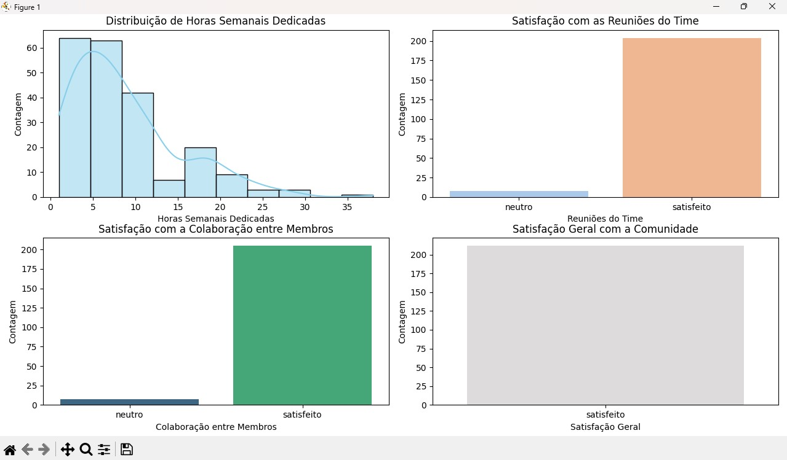
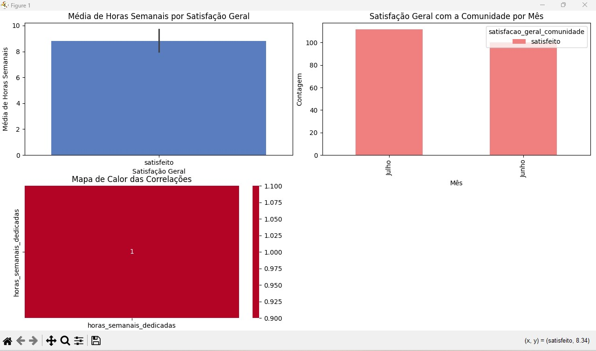

# Projeto de Análise de Dados: Satisfação da Comunidade

Desafio: O objetivo deste projeto é realizar uma análise detalhada dos dados encontrados em uma pesquisa de satisfação da comunidade nos meses de junho e julho de 2024 da Edtech Código Certo Coders.

## Desafios e Expectativas:
Realizar análise exploratória básica dos dados.
Criar visualizações simples e relatórios claros.
Utilizar ferramentas padrão de BI (Excel, Power BI, Tableau) para gerar insights.
Aplicar técnicas básicas de visualização para identificar tendências.
Produzir relatórios que apresentem os resultados de forma clara e compreensível.
Utilizar KPIs básicos, como taxa de satisfação e engajamento.

### Análise exploratória básica dos dados

Analisando os dados, percebe-se que os meses de junho e julho de 2024 contêm informações sobre feedback de membros de uma equipe, incluindo a data, nome completo, status atual, equipe, satisfação com reuniões, colaboração, ambiente de aprendizagem, comunicação, satisfação geral, horas semanais dedicadas, e comentários adicionais.

Analisando esses dados para obter uma análise básica de satisfação geral e horas semanais dedicadas com Python, conseguimos alguns insights, como a distribuição da satisfação geral:

•	A maioria dos membros está satisfeita, com 211 respostas indicando "satisfeito".
•	Apenas uma resposta foi registrada como "neutro", sugerindo que a satisfação geral é alta.
•	A média das horas semanais dedicadas pelos membros é de aproximadamente 8,83 horas.

Essas análises iniciais demostram que a satisfação geral é alta e que a maioria dos membros dedica cerca de 8 a 9 horas semanais ao projeto voluntário. 

### Crie visualizações simples e relatórios claros.

  

### Utilizar ferramentas padrão de BI (Excel, Power BI, Tableau) para gerar insights.

  

### Aplicar técnicas básicas de visualização para identificar tendências.

   

### Utilização de KPIs básicos, como taxas de satisfação e engajamento.

Calculando as métricas de taxa de satisfação e taxa de engajamento dos dados de junho e julho, encontramos:
Taxa de Satisfação: 100,00%
Taxa de Engajamento: 63,21%

#### Neste relatório de análise de dados, conclui-se que os voluntários estão satisfeitos e se envolvem ativamente nas atividades de voluntariado. Relatório de Análise de Dados para Trilha Final Ciência de Dados Jr com foco em Analista de Dados e Business Intelligence I - Nível Júnior do Código Certo Coders
